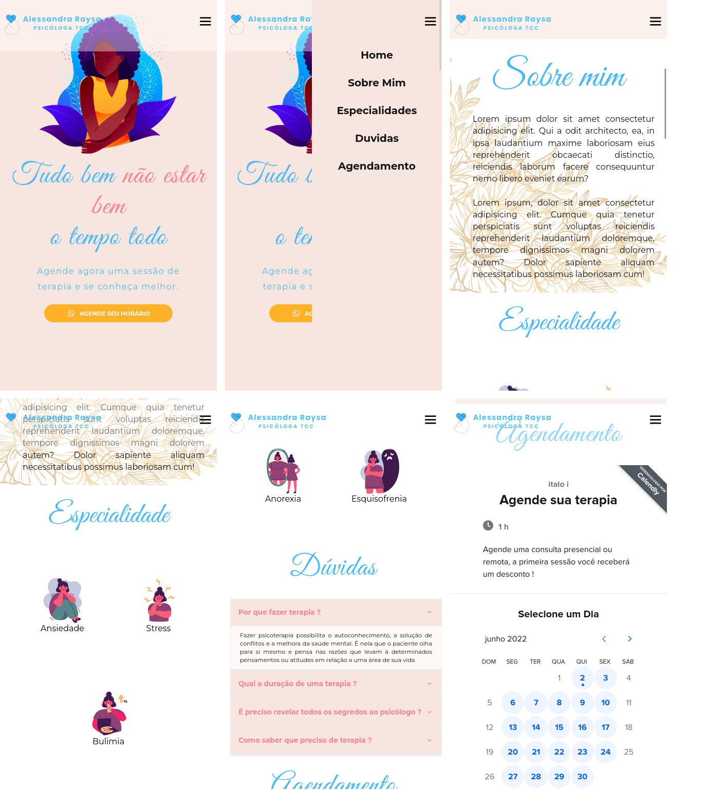

<h1 align="center">
     <a href="#" alt="site de despesa"> Serviços Psi </a>
</h1>

<h3 align="center">
    Site de portfólio para profissional de psicologia
</h3>

<h4 align="center">
	🚧   Concluído 🚀 🚧
</h4>

Tabela de conteúdos
=================
<!--ts-->
   * [Sobre o projeto](#-sobre-o-projeto)
   * [Funcionalidades](#-funcionalidades)
   * [Layout](#-layout)
   * [Tecnologias](#-tecnologias)

<!--te-->

## 💻 Sobre o projeto

Este site foi criado para uma concluinte em psicologia, tinha como objetivo apresentar seus serviços e possuir um sistema de marcação de consultas.

---

## ⚙️ Funcionalidades

- [x] Apresentar profissional
- [x] Apresentar especialidades
- [x] Marcar na agenda da psicologa uma nova consulta em algum horário disponivel.

---

## 🎨 Layout 

### Web

  

### Mobile
    
  

## 🛠 Tecnologias

As seguintes ferramentas foram usadas na construção do projeto:

-   **HTML**
-   **CSS**
-   **Javascript**
-   **Responsividade**

